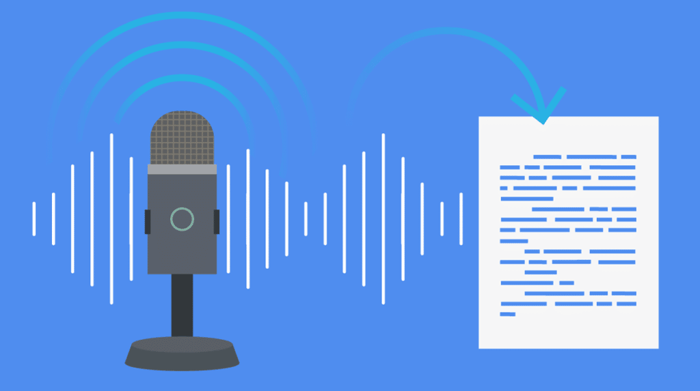

# Verba

This project seeks to produce a tool called Verba, which is essentially a speech to text generator. We will begin by understanding the fundamentals of Machine understanding and Deep Learning, then explore several models for handling sequential data such as audio, before moving on to our final project, Verba. The primary aims of this project are as follows:

1. **Audio Understanding**: To analyze and interpret sound signals, helping us in our final aim.

2. **Sentiment Analysis of Speech**: To determine the emotional tone or intent behind spoken words.

3. **Speech-to-Text Conversion**: To develop efficient models that accurately transcribe spoken language into written text.

> [!IMPORTANT]  
> #### Assignment one has been released, please check it out [here](./assignments/README.md).

## Week 1

#### Introduction to NumPy

- Official documentation: [NumPy: the absolute basics for beginners](https://numpy.org/doc/2.1/user/absolute_beginners.html)  
- Video Tutorial: [Introduction to Numpy](https://www.youtube.com/watch?v=QUT1VHiLmmI)
- Tutorial from [W3 Schools](https://www.w3schools.com/python/numpy)

#### Introduction to Pandas

- Official documentation: [Pandas: Getting started tutorials](https://pandas.pydata.org/docs/getting_started/intro_tutorials/index.html)
- Video Tutorial: [Introduction to Pandas](https://www.youtube.com/watch?v=dUpyC40cF6Q&list=PLUaB-1hjhk8GZOuylZqLz-Qt9RIdZZMBE)
- Tutorial from [W3 Schools](https://www.w3schools.com/python/pandas)

#### Introduction to Deep Learning
- Video Tutorial: [Introduction to Deep learning](https://www.youtube.com/playlist?list=PLZbbT5o_s2xq7LwI2y8_QtvuXZedL6tQU)

#### Introduction to Audio data

- Video Tutorial: [Introduction to audio data](https://www.youtube.com/playlist?list=PL-wATfeyAMNqIee7cH3q1bh4QJFAaeNv0)  
(*Watch the first 6 videos of the above playlist.*)
- Medium Articles:  
(*It is highly recommended to read and understand the content of these articles.*)
    - [Part 1](https://towardsdatascience.com/audio-deep-learning-made-simple-part-1-state-of-the-art-techniques-da1d3dff2504)
    - [Part 2](https://towardsdatascience.com/audio-deep-learning-made-simple-part-2-why-mel-spectrograms-perform-better-aad889a93505)  

## Week 2

#### RNNs and LSTMs
- Youtube videos : [here](https://www.youtube.com/playlist?list=PLKnIA16_RmvYuZauWaPlRTC54KxSNLtNn)  
(*Watch from video index **55** to video index **66**.*)

- For a formal presentation of the topic, read the pdf [here](./assets/rnn_tutorial.pdf).

#### CNNs

- Learn the basics of convolutional neural networks from [here](https://medium.com/@prathammodi001/convolutional-neural-networks-for-dummies-a-step-by-step-cnn-tutorial-e68f464d608f).

- Or you can go through the videos related to CNNs in the deep learning playlist in week 1 resources.

## Week 3

#### Working with audio data:

This week you will be handling the actual audio data, so it is necessary to know how to preprocess audio data and how to extract useful features out of it that can be used as input for Deep Learning models.

- Go through this Matplotlib tutorial, a library to create various plots in python. You will be using this to visualize various audio  [(here)](https://www.youtube.com/watch?v=OZOOLe2imFo).

- Go through the guided tutorial to learn these basic techniques [(here)](https://www.kaggle.com/code/sahandissanayaka/complete-notebook-for-audio-preprocessing).
